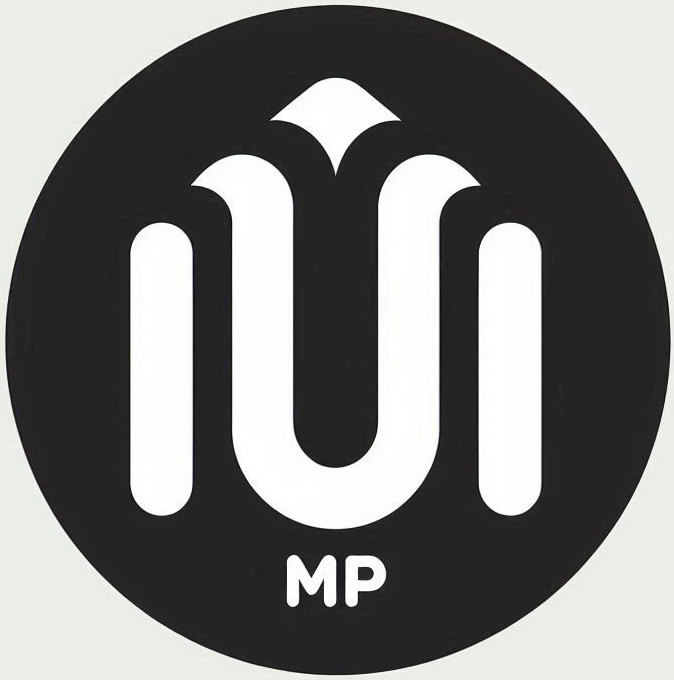

# 🎵 RMP - Ray Media Platform

<p align="center">
  
</p>

<p align="center">
  <strong>A Powerful Lua Framework for Terminal Applications</strong>
</p>

<p align="center">
  🎵 Music Player | 🎨 Custom Themes | 🔌 Plugin System | 🎮 2D Games | 📱 TUI Applications
</p>

---

## ✨ What is RMP?

**RMP (Ray Music Player)** is more than just a music player—it's a comprehensive Lua framework for creating stunning terminal user interfaces. Born from the need for a beautiful, extensible music player, RMP has evolved into a powerful platform that enables developers to create:

- 🎵 **Custom Music Players** with beautiful themes
- 📱 **TUI Applications** with rich interfaces  
- 🎮 **Simple 2D Games** running directly in the terminal
- 🔧 **System Tools** with interactive interfaces
- 🎨 **Visual Applications** with cross-platform support

## 🚀 Key Features

### 🎨 **Theme System**
- **Hot-swappable themes** - Change the entire look without restarting
- **Lua-powered theming** - Full programmatic control over UI
- **Cross-platform compatibility** - Works on Linux, macOS, and Windows
- **Rich visual elements** - Unicode box drawing, colors, and animations

### 🔌 **Plugin Architecture**
- **Modular design** - Each feature as a separate plugin
- **Event-driven system** - React to user input and system events  
- **Easy integration** - Drop-in plugin support
- **Background services** - Run plugins independently

### 🎵 **Out-of-the-Box Music Player**
- **Multiple audio formats** - MP3, WAV, FLAC support
- **File explorer** - Navigate and play music intuitively
- **Playlist management** - Queue, shuffle, repeat
- **Real-time controls** - Volume, seeking, speed control

### 🎮 **Game Development Ready**
- **Virtual terminal** - Advanced text-based graphics
- **Input handling** - Keyboard and mouse support
- **Frame management** - Smooth animations and updates
- **Collision detection** - Built-in game utilities

## Demo
### check asstets file

## 📦 Installation

### Prerequisites
```bash
# all u need is gcc if u are compiling and installing from cloned repo

# Debian/Ubuntu
sudo apt-get install gcc lua5.4 liblua5.4-dev

# macOS (with Homebrew)
brew install gcc lua

# Windows (with MSYS2)
# install mingw from google
```

### Build from Source
```bash
git clone https://github.com/abdorayden/raymp.git
cd raymp
cd install/
# if posix 
./install.sh compile -v && sudo ./install.sh install -v
cd ..
./rmp
```

### Quick Start
```bash
# Run the music player
./rmp
```

## 🎯 Usage Examples

### 🎵 Music Player (Default)
```lua
local rmp = require("rmp")

-- The default theme provides a full-featured music player
-- Just run: ./rmp
```

### 📱 Custom TUI Application
```lua
local api = require("rmp.rmp")
local Window = api.Window
local Terminal = api.Terminal
local Frame = api.Frame

-- Create a simple hello world app
local frame = Frame.new()
frame:setFps(60)

local window = Window.new(1):createWindow(
    "Hello RMP!", 40, 10, 5, 5, nil, nil, nil,
    function(x, y, w, h)
        -- Your app logic here
        return api.Text.new("Welcome to RMP Framework!", 
                           x+2, y+2, api.FGColors.Brights.Green)
    end
)

frame:add(window)
while true do
    local key = Terminal:handleKey()
    if key == api.KEY_Q then break end
    frame:run(key)
end
```

## 🎨 Theme Development

### Creating a Custom Theme
```lua
-- themes/my_theme.lua
--
--	simple 3-window rmp template
--	clean and functional starter layout
--

local api = require("rmp.rmp")

return {
	{
		id = 1,
		type = "Window",
		title = nil,
		width = "w",
		height = "h",
		x = 1,
		y = 1,
		border = api.BoxDrawing.LightBorder,
		backgroundColor = api.BGColors.NoBrights.Black,
		children = {
			-- Header Window
			{
				id = 3,
				type = "Window",
				title = {
					type = "Text",
					value = "RMP TERMINAL",
					foregroundColor = api.FGColors.Brights.Cyan,
					backgroundColor = api.BGColors.NoBrights.Black,
					style = api.TextStyle.Bold
				},
				width = "w - 2",
				height = 3,
				x = 2,
				y = 2,
				border = api.BoxDrawing.NoBorder,
				backgroundColor = api.BGColors.NoBrights.Blue
			},

			-- Main Content Window
			{
				id = 2,
				type = "Window",
				title = {
					type = "Text",
					value = "MAIN PANEL",
					foregroundColor = api.FGColors.Brights.Green,
					backgroundColor = api.BGColors.NoBrights.Black,
					style = api.TextStyle.Bold
				},
				width = "w - 4",
				height = "h - 10",
				x = 2,
				y = 6,
				border = api.BoxDrawing.LightBorder,
				backgroundColor = api.BGColors.NoBrights.Black
			},

			-- Status Bar Window
			{
				id = 4,
				type = "Window",
				title = {
					type = "Text",
					value = "READY",
					foregroundColor = api.FGColors.Brights.White,
					backgroundColor = api.BGColors.NoBrights.Green,
					style = api.TextStyle.Bold,
					dynamic = function(context)
						return "STATUS: ONLINE"
					end
				},
				width = "w - 2",
				height = 3,
				x = 2,
				y = "h - 3",
				border = api.BoxDrawing.NoBorder,
				backgroundColor = api.BGColors.NoBrights.Black
			}
		}
	}
}
```

## 🔌 Plugin Development

### Creating a Plugin
```lua
-- plugins/my_plugin.lua
local api = require("rmp.rmp")

return function(x, y, xx, yy)
    local w = xx - x - 1
    local y = yy - y - 1
    local vterm = api.VirtualTerminal.new()
    local content = {}
    
    -- Plugin logic
    vterm:writeText(x,y ,"Plugin Content", api.FGColors.Brights.Blue)
    
    -- Handle plugin-specific events
    vterm:addEventListener(api.KEY_SPACE , function()
        -- do something
    end)
    
    return vterm
end
```

### Plugin Registration
```lua
-- In your theme or config
plugins = {
    {
        themeWindowId = 2,  -- Window ID to attach to
        isActivated = true,
        activate = api.KEY_TAB,  -- Key to switch plugins
        name = "my_plugin",
    }
}
```

## 🎮 Game Development Features

### Virtual Terminal System
- **Cross-platform character width detection** (including CJK characters)
- **Advanced text rendering** with UTF-8 support
- **Box drawing characters** for creating interfaces
- **Color management** with 16-color and 256-color support

### Input System
- **Real-time key detection**
- **Non-blocking input handling**
- **Special key support** (arrows, function keys, etc.)
- **Mouse support** (coming soon)

### Graphics Capabilities
- **Text-based sprites**
- **Animation systems**
- **Collision detection**
- **Screen buffer management**

## 🌍 Cross-Platform Support

RMP works seamlessly across platforms:

- ✅ **Linux** (Debian, Ubuntu, Arch, etc.)
- ✅ **macOS** (Intel and Apple Silicon)
- ✅ **Windows** (MinGW, MSYS2, WSL)

## 📚 API Reference

### Core Components
- **`api.Frame`** - Main application frame and event loop
- **`api.Window`** - Window management and layouts
- **`api.Terminal`** - Terminal control and input handling
- **`api.Text`** - Text rendering with colors and styles
- **`api.Audio`** - Audio playback and control

### Utilities
- **`api.Config`** - Configuration management
- **`api.BGColors api.FGColors`** - Color constants and utilities
- **`api.BoxDrawing`** - Unicode box drawing characters
- **`api.Keys`** - Key code constants

## 🤝 Contributing

We welcome contributions! Check out our [Contributing Guide](CONTRIBUTIONS.md).

### Development Setup
```bash
git clone https://github.com/abdorayden/raymp.git
cd raymp
```

## 📄 License

read LICENCE file.

## 🙏 Acknowledgments

- **Miniaudio** - Audio library
- **Lua** - Scripting language
---

<p align="center">
  <strong>🎵 Start creating amazing terminal applications with RMP today! 🎵</strong>
</p>

<p align="center">
  <a href="#installation">Get Started</a> •
  <a href="#usage-examples">Examples</a> •
  <a href="#api-reference">API Docs</a> •
  <a href="#contributing">Contribute</a>
</p>
